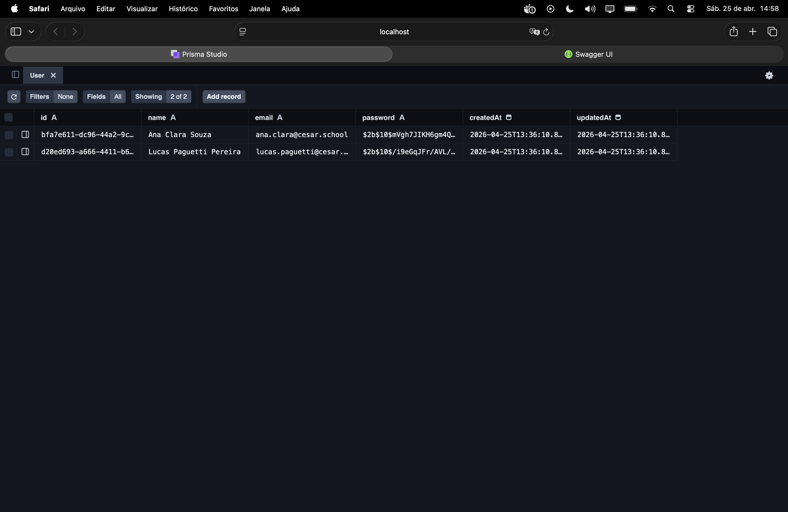
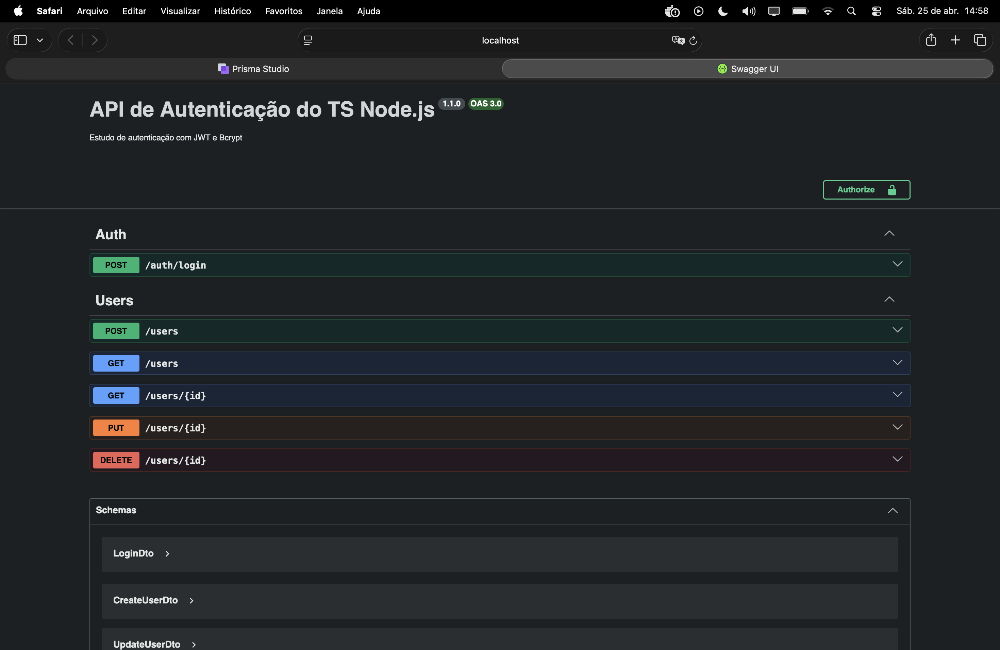

<h1 align="center">API - Swagger + Node.js com TypeScript<br>
</h1>
 
<h2 align="center">👨🏻‍💻 Autor deste Projeto:</h2>
 
<p align="center">
  <strong>Lucas Paguetti Pereira</strong> 🦇<br>
  🏫 <strong>Instituição:</strong> Cesar School 🎓🧡<br>
  📍 Recife, Pernambuco — <strong>Brazil</strong> 🇧🇷
</p>
<p align="center">
  <a href="https://www.instagram.com/lucpaguetti/">
    
  </a>
  <a href="https://github.com/wqiluc">
    
  </a>
  <a href="https://www.linkedin.com/in/lucas-paguetti-pereira-70267339b/">
    
  </a><br>
  <a href="mailto:lpp2@cesar.school">
    
  </a><br>
  <a href="https://discord.com/users/lucaspaguettipereira">
    
  </a>
</p>
 
<h2 align="center">💻⛏️ Ferramentas e Tecnologias Utilizadas:</h2>
 
<p align="center">
  
  
  
  
  
  
  
  <br>
  
  
  <br>
  
  
  
  <br>
  
  
  
</p>


<h2 align="center"> 🏛️ Arquitetura do Repositório: <br>
</h2>

<pre>
API_AND_Swagger_UI/
├── BACKEND /
│   ├── prisma /
│   │   ├── prisma.module.ts 
│   │   ├── prisma.service.ts 
│   │   └── schema.prisma 
│   │   └── test-user.ts 
|   |   └── migrations /
│   ├── src src-green?style=flat&logo=image&logoColor=white" height="18"/>/
│   │   ├── auth /
│   │   │   ├── dto /
│   │   │   │   ├── login.dto.ts 
│   │   │   │   └── login_update.dto.ts 
│   │   │   └── ts /
│   │   │       ├── auth.controller.ts 
│   │   │       ├── auth.service.ts 
│   │   │       ├── auth.module.ts 
│   │   │       └── jwt.strategy.ts  
│   │   ├── users /
│   │   │   ├── dto /
│   │   │   │   ├── user.dto.ts 
│   │   │   │   └── user_update.dto.ts 
│   │   │   └── ts /
│   │   │       ├── users.controller.ts 
│   │   │       ├── users.service.ts 
│   │   │       └── users.module.ts 
│   │   └── main.ts 
│   │   └── app.controller.ts 
│   │   └── app.module.ts 
│   ├── .eslintrc.ts 
│   ├── .prettierrc 
│   ├── docker-compose.yml 
│   ├── dockerfile 
│   ├── openapi.yml 
|   ├── tsconfig.json 
|   ├── tsconfig.build.json 
├── .dockerignore 
├── .gitignore 
├── img /
├── nest-cli.json 
├── License 
└── README.md 
</pre>


<h2 align="center">📂 Modularização SCM (Service, Module & Controller)<br>


</h2>
 
###  `.controller.ts`
 
Camada de **entrada da API**. Recebe as requisições HTTP e define as rotas (`@Get`, `@Post`, `@Put`, `@Delete`). Não contém lógica de negócio — apenas delega ao Service. É aqui que os decorators do Swagger (`@ApiOperation`, `@ApiResponse`) são aplicados.
 
**Arquivos neste projeto:** `auth.controller.ts` `users.controller.ts` `app.controller.ts`
 
---
 
###  `.service.ts`
 
Camada de **lógica de negócio**. Processa os dados recebidos do Controller, aplica as regras da aplicação (validações, hash de senha com `bcrypt`, geração de JWT) e comunica com o banco via Prisma. Injetado no Controller via `@Injectable()`.
 
**Arquivos neste projeto:** `auth.service.ts` `users.service.ts` `prisma.service.ts`
 
---
 
###  `.module.ts`
 
**Unidade de organização** do NestJS. Agrupa e registra o Controller e o Service de um domínio (`imports`, `providers`, `controllers`, `exports`). Permite que outros módulos reutilizem os providers via `exports`. O `AppModule` é o módulo raiz que importa todos os demais.
 
**Arquivos neste projeto:** `auth.module.ts` `users.module.ts` `prisma.module.ts` `app.module.ts`
 
---
 
<h2 align="center">🔑 Versões Necessárias para Compilar:</h2>
 
<p align="center">
  
  
  
  
  
  
  
  
  
  
  
  
</p>

 
<h2 align="center">🕹️ Comandos</h2>
 
Clone o repositório via GitHub Desktop ou terminal:
 
```bash
git clone https://github.com/wqiluc/API_AND_Swagger_UI
```
 
---
 
<h2 align="center">1. Docker<br>


</h2>
 
> 📖 [Docker Docs](https://docs.docker.com)
 
```bash
# Constrói (ou reconstrói) as imagens definidas no docker-compose.yml
docker-compose build
 
# Reconstrói sem usar cache (forçar rebuild completo)
docker-compose build --no-cache
 
# Sobe todos os containers em background
docker-compose up -d
 
# Sobe apenas o container do banco de dados
docker-compose up -d db
 
# Sobe e reconstrói as imagens antes de iniciar
docker-compose up -d --build
 
# Para os containers sem removê-los
docker-compose stop
 
# Para e remove os containers (útil quando algo trava)
docker-compose down
 
# Para, remove containers E volumes (reseta o banco de dados)
docker-compose down -v
 
# Reinicia um container específico
docker compose restart api
 
# Mostra os logs em tempo real
docker-compose logs -f
 
# Mostra os logs de um serviço específico
docker-compose logs -f api
 
# Lista os containers em execução
docker-compose ps
 
# Lista todos os containers (incluindo parados)
docker-compose ps -a
 
# Executa um comando dentro de um container em execução
docker-compose exec api bash
 
# Remove containers parados, redes e imagens não usadas
docker system prune -f
 
# Remove também os volumes não usados (limpeza total)
docker system prune -f --volumes
```
 
---
 
<h2 align="center">2. Prisma<br>

</h2>
 
> 📖 [Prisma Docs](https://www.prisma.io/docs)
 
> ⚠️ Os comandos do Prisma devem ser rodados de dentro da pasta `BACKEND/`
 
```bash
# Inicializa o Prisma no projeto (cria /prisma e schema.prisma)
docker-compose exec api npx prisma init
 
# Gera o Prisma Client (rode sempre após alterar o schema.prisma)
docker-compose exec api npx prisma generate
 
# Cria e aplica uma nova migration em desenvolvimento
docker-compose exec api npx prisma migrate dev --name init
 
# Aplica migrations em produção
docker-compose exec api npx prisma migrate deploy
 
# Reseta o banco e reaplica todas as migrations
docker-compose exec api npx prisma migrate reset
 
# Mostra o status das migrations
docker-compose exec api npx prisma migrate status
 
# Sincroniza o schema sem criar migration (útil em prototipagem)
docker-compose exec api npx prisma db push
 
# Puxa o schema a partir de um banco existente
docker-compose exec api npx prisma db pull
 
# Roda o arquivo de seed
docker-compose exec api npx prisma db seed
 
# Abre o Prisma Studio no navegador (porta 5555)
docker-compose exec api npx prisma studio
 
# Formata o schema.prisma
docker-compose exec api npx prisma format
 
# Valida o schema.prisma
docker-compose exec api npx prisma validate
 
# Introspecta o banco existente
docker-compose exec api npx prisma introspect
 
# ✅ Novos no Prisma v7
npx prisma dev                         # Inicia o servidor Prisma Postgres local
npx prisma platform login              # Autentica na Prisma Platform
npx prisma platform project create    # Cria projeto na Prisma Platform
npx prisma platform env create        # Cria variáveis de ambiente na Platform
```
 
---
 
<h2 align="center">3. NestJS / NPM<br>


</h2>
 
> 📖 [NPM Docs](https://docs.npmjs.com)
 
> ⚠️ Rode de dentro da pasta raiz `API_AND_Swagger_UI/`
 
```bash
# Instala todas as dependências do package.json
npm install
 
# Inicia o servidor em modo de desenvolvimento (hot reload)
npm run start:dev
 
# Compila o projeto para produção (gera a pasta /dist)
npm run build
 
# Verifica erros de lint
npm run lint
 
# Formata o código automaticamente com Prettier
npm run format
```
 
---
 
<h2 align="center">4. Gerenciamento de Dependências<br>


</h2>
 
| Ação | Comando Local | Comando via Docker |
|------|--------------|--------------------------|
| Instalar produção | `npm install <pacote>@latest` | `docker compose exec api npm install <pacote>@latest` |
| Instalar dev | `npm install <pacote>@latest -D` | `docker compose exec api npm install <pacote>@latest -D` |
| Remover pacote | `npm uninstall <pacote>` | `docker compose exec api npm uninstall <pacote>` |
| Atualizar tudo | `npm update` | `docker compose exec api npm update` |
| Listar pacotes | `npm list --depth=0` | `docker compose exec api npm list --depth=0` |
 
> **Dica:** Prefira rodar instalações dentro do Docker para evitar incompatibilidades entre seu ambiente local e o container.
 
**Limpeza em caso de erros:** 🧹
 
```bash
docker-compose down
rm -rf node_modules package-lock.json
npm install
docker-compose up -d --build
```
 
 
<h2 align="center">5. Instalação Completa das Dependências<br>

</h2>
 
> ⚠️ Rode de dentro da pasta `BACKEND/`
 
```bash
# Dependências de produção
npm install @nestjs/common @nestjs/core @nestjs/platform-express \
  @nestjs/config @nestjs/jwt @nestjs/passport @nestjs/swagger @nestjs/mapped-types \
  passport passport-jwt @prisma/client bcrypt \
  class-validator class-transformer reflect-metadata rxjs swagger-ui-express dotenv
 
# Dependências de desenvolvimento
npm install -D prisma @types/passport-jwt @types/bcrypt @types/node \
  @nestjs/cli @nestjs/schematics typescript ts-node
```
 
**Via Docker (recomendado):** <br>

 
```bash
docker compose exec api npm install @nestjs/common @nestjs/core @nestjs/platform-express \
  @nestjs/config @nestjs/jwt @nestjs/passport @nestjs/swagger @nestjs/mapped-types \
  passport passport-jwt @prisma/client bcrypt \
  class-validator class-transformer reflect-metadata rxjs swagger-ui-express dotenv
 
docker compose exec api npm install -D prisma @types/passport-jwt @types/bcrypt @types/node \
  @nestjs/cli @nestjs/schematics typescript ts-node
```
 
 
<h2 align="center">6. GitIgnore<br>

</h2>
 
```bash
# Dependências
node_modules/
 
# Build
dist/
build/
out/
 
# Logs
*.log
npm-debug.log*
 
# Variáveis de ambiente — NUNCA envie para o GitHub!
.env
.env.local
.env.*.local
 
# IDEs e sistema
.vscode/
.idea/
.DS_Store
Thumbs.db
 
# Testes
coverage/
.nyc_output/
 
# Outros
.eslintcache
.tmp/
```
 

<h2 align="center">🔐 Criptografia com bcrypt<br>


</h2>
 
O `bcrypt` converte a senha em texto puro em um **hash irreversível** antes de salvar no banco. O salt rounds `10` define o custo computacional — quanto maior, mais seguro e mais lento.
 
```ts
import * as bcrypt from 'bcrypt';
 
// No cadastro (users.service.ts / auth.service.ts)
const SALT_ROUNDS = 10;
const hashedPassword = await bcrypt.hash(plainTextPassword, SALT_ROUNDS);
 
await this.prisma.user.create({
  data: {
    email,
    password: hashedPassword, // nunca salva a senha em texto puro
  },
});
 
// No login (auth.service.ts)
const isMatch = await bcrypt.compare(plainTextPassword, user.password);
if (!isMatch) throw new UnauthorizedException('Credenciais inválidas');
```
 
O prefixo `$2b$10$` armazenado no banco é decodificável assim:
 
| Segmento 🛡️ | Valor 🧪 | Significado 🔑 |
|------------|---------|--------------|
| `$2b$` | algoritmo | versão do bcrypt |
| `$10$` | cost factor | 10 salt rounds |
| restante | hash | 53 chars = salt + digest |
 
**Arquivos relevantes:** `jwt.strategy.ts` `auth.service.ts` `users.service.ts`
 
 
<h2 align="center">👤 Teste de Criação de Usuário<br>

</h2>
 
```bash
cd BACKEND
npx tsx prisma/test-user.ts
```
 
```ts
import * as bcrypt from 'bcrypt';
import { PrismaClient } from '@prisma/client';

const prisma = new PrismaClient();

async function principal() 
{
  try 
  {
    const senha1 = await bcrypt.hash('anonovo1234abcd', 10);
    const usuario1 = await prisma.user.upsert({
      where: { email: 'lucas.paguetti@cesar.school' },
      update: {},
      create: 
      {
        name: 'Lucas Paguetti Pereira',
        email: 'lucas.paguetti@cesar.school',
        password: `${senha1}`,
      },
    });
    console.log(`Usuário 1: ${usuario1.name}, \n Email: ${usuario1.email}`);

    const senha2 = await bcrypt.hash('testedesenhadocker', 10);
    const usuario2 = await prisma.user.upsert({
      where: { email: 'ana.clara@cesar.school' },
      update: {},
      create: 
      {
        name: 'Ana Clara Souza',
        email: 'ana.clara@cesar.school',
        password: `${senha2}`,
      },
    });

    console.log(`Usuário 2: ${usuario2.name}, \n Email: ${usuario2.email}`);
  } catch (error) 
  {
    console.error(error);
    
  } finally 
  {
    await prisma.$disconnect();
  }
}

principal();
```
 
<h2 align="center">Prisma Studio na Prática <br>

</h2>
 
```bash
# Abre o Prisma Studio no navegador (porta 5555 por padrão)
docker-compose exec api npx prisma studio
```
 
Acesse a tabela `User` → coluna `password`. O valor armazenado será semelhante a `$2b$10$Kf3Q...`, confirmando que o bcrypt foi aplicado corretamente com 10 salt rounds.
 
<p align="center">
  
</p>
 
<h2 align="center"> Swagger UI na Prática <br>


</h2>
 
Com o servidor rodando, acesse a documentação interativa da API pelo navegador:
 
```bash
#após rodar na PASTA BACKEND/ :
npm run start:dev
```


```
http://localhost:3000/api
```
 
O Swagger é configurado em `main.ts` via `@nestjs/swagger` e documentado com decorators nos controllers (`@ApiOperation`, `@ApiResponse`, `@ApiBody`, `@ApiBearerAuth`). O arquivo `openapi.yml` na raiz do projeto contém a especificação completa da API no formato OpenAPI 3.0.
 
**Endpoints documentados:**
 
| Método | Rota | Descrição |
|--------|------|-----------|
| `@POST` |`/auth/login` | Autenticação — retorna o token JWT |
| `@GET` | `/users` | Lista todos os usuários (requer Bearer Token) |
| `@GET by ID` | `/users/:id` | Busca um usuário pelo ID (requer Bearer Token) |
| `@POST` | `/users` | Cria um novo usuário |
| `@PUT` | `/users/:id` | Atualiza um usuário (requer Bearer Token) |
| `@DELETE` | `/users/:id` | Remove um usuário (requer Bearer Token) |
 
**Como testar rotas protegidas no Swagger:**
 
1. Execute `POST /auth/login` com suas credenciais
2. Copie o `access_token` retornado na resposta
3. Clique em **Authorize 🔒** no topo da página do Swagger
4. Cole o token no campo `Bearer Token` e confirme
5. Todas as rotas protegidas passarão a enviar o header `Authorization: Bearer <token>` automaticamente

```ts
import { NestFactory } from '@nestjs/core';

import { AppModule } from './app.module';

import { DocumentBuilder, SwaggerModule } from '@nestjs/swagger';

async function SwaggerOnline() 
{
  const app = await NestFactory.create(AppModule);

  const config = new DocumentBuilder()
    .setTitle('API de Autenticação do TS Node.js')
    .setDescription('Estudo de autenticação com JWT e Bcrypt no NODE.js')
    .setVersion('1.1.0')
    .addBearerAuth()
    .build();

  const document = SwaggerModule.createDocument(app, config);
  SwaggerModule.setup('api', app, document);

  await app.listen(process.env.PORT ?? 3000);
}

SwaggerOnline();
```
 

<h2 align="center"></h2>

<p align="center">
  
  
  
</p>