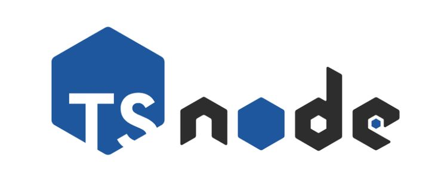

<h1 align="center">API - Swagger + Node.js com Typescript <br>
</h1>

<h2 align="center">👨🏻‍💻 Autor deste Projeto:</h2>

<p align="center">
<strong>Lucas Paguetti Pereira</strong> 🦇 <br>
🏫 <strong>Instituição:</strong> Cesar School 🎓🧡 <br>
📍 Recife, Pernambuco — <strong>Brazil</strong> 🇧🇷
</p>

<p align="center">
<a href="https://www.instagram.com/lucpaguetti/">

</a>
<a href="https://github.com/wqiluc">

</a>
<a href="https://www.linkedin.com/in/lucas-paguetti-pereira-70267339b/">

</a> <br>
<a href="mailto:lpp2@cesar.school">

</a> <br>
<a href="https://discord.com/users/lucaspaguettipereira">

</a>
</p>

<h2 align="center"> 💻⛏️ Ferramentas e Tecnologias Utilizadas: </h2>
<p align="center">
  
  
  
  
  
  
  
   <br>
  
  
   <br>
  
  
   <br>
  
  
  
</p>

<h2 align="center"> 🏛️ Arquitetura do Repositório: <br>
</h2>

<pre>
API_AND_Swagger_UI/
├── BACKEND /
│   ├── prisma /
│   │   ├── prisma.config.ts 
│   │   ├── prisma.module.ts 
│   │   ├── prisma.service.ts 
│   │   └── schema.prisma 
|   |   └── migrations /
│   ├── src src-green?style=flat&logo=image&logoColor=white" height="18"/>/
│   │   ├── auth /
│   │   │   ├── dto /
│   │   │   │   ├── login.dto.ts 
│   │   │   │   └── login_update.dto.ts 
│   │   │   └── ts /
│   │   │       ├── auth.controller.ts 
│   │   │       ├── auth.service.ts 
│   │   │       ├── auth.module.ts 
│   │   │       └── jwt.strategy.ts  
│   │   ├── users /
│   │   │   ├── dto /
│   │   │   │   ├── user.dto.ts 
│   │   │   │   └── user_update.dto.ts 
│   │   │   └── ts /
│   │   │       ├── users.controller.ts 
│   │   │       ├── users.service.ts 
│   │   │       └── users.module.ts 
│   │   └── main.ts 
│   ├── .eslintrc.ts 
│   ├── .prettierrc 
│   ├── docker-compose.yml 
│   ├── dockerfile 
│   ├── openapi.yml 
│   ├── app.controller.ts 
│   ├── app.module.ts 
│   ├── package.json 
|   ├── tsconfig.json 
|   ├── tsconfig.build.json 
├── .dockerignore 
├── .gitignore 
├── img /
├── nest-cli.json 
├── License 
└── README.md 
</pre>


<h2 align="center"> 📂 Modularização SCM (Service, Module & Controller) <br>
</h2>


###  `.controller.ts`

Camada de **entrada da API**. Recebe as requisições HTTP e define as rotas (`@Get`, `@Post`, `@Put`, `@Delete`). Não contém lógica de negócio — apenas delega ao Service. É aqui que os decorators do Swagger (`@ApiOperation`, `@ApiResponse`) são aplicados.

**Arquivos neste projeto:**
`auth.controller.ts` `users.controller.ts` `app.controller.ts`

---

###  `.service.ts`

Camada de **lógica de negócio**. Processa os dados recebidos do Controller, aplica as regras da aplicação (validações, hash de senha com `bcrypt`, geração de JWT) e comunica com o banco via Prisma. Injetado no Controller via `@Injectable()`.

**Arquivos neste projeto:**
`auth.service.ts` `users.service.ts` `prisma.service.ts`

---

###  `.module.ts`

**Unidade de organização** do NestJS. Agrupa e registra o Controller e o Service de um domínio (`imports`, `providers`, `controllers`, `exports`). Permite que outros módulos reutilizem os providers via `exports`. O `AppModule` é o módulo raiz que importa todos os demais.

**Arquivos neste projeto:**
`auth.module.ts` `users.module.ts` `prisma.module.ts` `app.module.ts`


<h2 align="center">Comandos 🕹️ <br>
</h2>

Após baixar o Github desktop: <br>


2. **Clone o repositório:**
```bash
   git clone https://github.com/wqiluc/API_AND_Swagger_UI
```

4. **Abra sua IDE de escolha:** <br>   

5. **Siga os seguintes comandos:** <br>

<h3 align="center"><b>1. Docker</b><br>
</h3>

```bash
# Sobe todos os containers definidos no docker-compose.yml em background
docker-compose up -d

# Para e remove os containers (útil quando algo trava)
docker-compose down

# Mostra os logs do container (essencial para debugar erros na inicialização)
docker-compose logs -f

# Lista os containers que estão rodando no momento
docker-compose ps

# Remove containers parados e redes não usadas (limpeza geral)
docker system prune -f
```

<h3 align="center"><b>2. Prisma</b><br>
</h3>

> ⚠️ Os comandos do Prisma devem ser rodados de dentro da pasta `BACKEND/prisma/`

```bash
# A estrutura é: docker compose exec  

# Inicializa o Prisma no projeto (cria a pasta /prisma e o schema.prisma)
docker-compose exec api npx prisma init

# Gera o Prisma Client (execute sempre após mudar o schema.prisma)
docker-compose exec api npx prisma generate

# Cria e aplica uma nova migração
docker-compose exec api npx prisma migrate dev --name init

# Aplica migrations em produção
docker-compose exec api npx prisma migrate deploy

# Reseta o banco e reaplica tudo
docker-compose exec api npx prisma migrate reset

# Mostra o status das migrations
docker-compose exec api npx prisma migrate status

# Sincroniza o schema sem criar migration (bom para prototipagem)
docker-compose exec api npx prisma db push

# Puxa o schema do banco existente
docker-compose exec api npx prisma db pull

# Roda o arquivo de seed
docker-compose exec api npx prisma db seed

# Abre a interface gráfica do Prisma Studio no navegador
docker-compose exec api npx prisma studio

# Formata o schema.prisma
docker-compose exec api npx prisma format

# Valida o schema.prisma
docker-compose exec api npx prisma validate

# Introspecta o banco existente
docker-compose exec api npx prisma introspect
```

<h3 align="center"><b>3. NestJS / NPM (Desenvolvimento)</b><br>
</h3>

> ⚠️ Rode de dentro da pasta raiz `API_AND_Swagger_UI/`

```bash
# Inicia o servidor em modo de desenvolvimento (reinicia automaticamente ao salvar)
npm run start:dev

# Compila o projeto (cria a pasta /dist para produção)
npm run build

# Verifica erros de digitação e formatação (linting)
npm run lint

# Formata o código automaticamente seguindo as regras do Prettier
npm run format
```

<h3 align="center"><b>4. GitIgnore (Controle de Versão)</b><br>
</h3>

```bash
# --- Dependências ---
node_modules/
jspm_packages/

# --- Artefatos de Build ---
dist/
build/
out/

# --- Logs ---
*.log
npm-debug.log*
yarn-debug.log*
yarn-error.log*
lerna-debug.log*

# --- Variáveis de Ambiente (CRUCIAL) ---
# NUNCA envie seus arquivos .env para o GitHub!
# Seus tokens, senhas de banco de dados e chaves ficam aqui.
.env
.env.local
.env.*.local

# --- IDEs e Configurações de Sistema ---
.vscode/
.idea/
*.sublime-*
.DS_Store
Thumbs.db

# --- Testes e Cobertura ---
coverage/
.nyc_output/

# --- Outros ---
.eslintcache
.tmp/
```

<h2 align="center"> 🔑 Versões Necessárias para compilar: </h2>
<p align="center">
  
  
  
  
  
  
  
  
  
  
  
  
</p>

<h2 align="center">🧭 Guia de Dependências: NestJS & Docker <br>
</h2>

<b>Este guia detalha como adiciona ✅, remover ❌ e gerenciar ⚙️ bibliotecas no seu projeto, garantindo compatibilidade entre seu ambiente local e o container Docker.</b>

<h2 align="center">1. Instalação Inicial</h2>
Ao clonar o projeto pela primeira vez, instale todas as dependências definidas no `package.json`: 

```bash
npm install
```

## 2. Adicionando Novos Pacotes
Sempre utilize a tag `@latest` para garantir a versão mais recente e estável.

Para Produção: Bibliotecas que a aplicação precisa para rodar (ex: axios, jwt, swagger).
```bash
npm install @latest
```

Para Desenvolvimento: Ferramentas de suporte que não vão para produção (ex: eslint, prettier, @types/).
```bash
npm install @latest -D
```

> <mark>Dica</mark>: **Para evitar erros de compatibilidade, prefira rodar a instalação dentro do Docker Desktop **

## 3. Tabela de Gerenciamento

| Ação | Comando Local | Comando via Docker (api) |
|------|--------------|--------------------------|
| Instalar Produção | `npm install <pacote>@latest` | `docker compose exec api npm install <pacote>@latest` |
| Instalar Dev | `npm install <pacote>@latest -D` | `docker compose exec api npm install <pacote>@latest -D` |
| Remover Pacote | `npm uninstall <pacote>` | `docker compose exec api npm uninstall <pacote>` |
| Atualizar Tudo | `npm update` | `docker compose exec api npm update` |
| Listar Pacotes | `npm list --depth=0` | `docker compose exec api npm list --depth=0` |

## 4. Melhores Práticas

**Sincronização:** Como configuramos um volume no `docker-compose.yml`, tudo o que for instalado via Docker será espelhado automaticamente na sua pasta `node_modules` local.

**Versionamento:** Sempre realize o commit do arquivo `package-lock.json`. Ele garante que todos os ambientes tenham as mesmas versões instaladas.

**Limpeza (se houver erros):** 🧹
```bash
docker-compose down
rm -rf node_modules package-lock.json
npm install
docker-compose up -d
```

**Reinicialização:** Se a nova biblioteca não for reconhecida, basta reiniciar o container:
```bash
docker compose restart api
```

> [!NOTE]
> <h2 align="center"> Docker & Dependências NPM <br>  </h2>

> ### Antes de rodar o projeto, instale todas as dependências dentro da pasta `BACKEND/`:

> ```bash
> # Dependências de produção 🔧
> npm install @nestjs/common @nestjs/core @nestjs/platform-express
> npm install @nestjs/config @nestjs/jwt @nestjs/passport @nestjs/swagger @nestjs/mapped-types
> npm install passport passport-jwt
> npm install @prisma/client
> npm install bcrypt
> npm install class-validator class-transformer
> npm install reflect-metadata rxjs swagger-ui-express
> npm install dotenv
>
> # Dependências de desenvolvimento 🧭
> npm install -D prisma
> npm install -D @types/passport-jwt @types/bcrypt @types/node
> npm install -D @nestjs/cli @nestjs/schematics
> npm install -D typescript ts-node
> ```

> ### Ou tudo de uma vez:

> ```bash
> npm install @nestjs/common @nestjs/core @nestjs/platform-express @nestjs/config @nestjs/jwt @nestjs/passport @nestjs/swagger @nestjs/mapped-types passport passport-jwt @prisma/client bcrypt class-validator class-transformer reflect-metadata rxjs swagger-ui-express dotenv
> npm install -D prisma @types/passport-jwt @types/bcrypt @types/node @nestjs/cli @nestjs/schematics typescript ts-node
> ```

> ### Via Docker (recomendado): <br>

> ```bash
> docker compose exec api npm install @nestjs/common @nestjs/core @nestjs/platform-express @nestjs/config @nestjs/jwt @nestjs/passport @nestjs/swagger @nestjs/mapped-types passport passport-jwt @prisma/client bcrypt class-validator class-transformer reflect-metadata rxjs swagger-ui-express dotenv
> docker compose exec api npm install -D prisma @types/passport-jwt @types/bcrypt @types/node @nestjs/cli @nestjs/schematics typescript ts-node
> ```


> ### ⚠️ Após instalar o Prisma, rode de dentro de `BACKEND/prisma/`: <br>

> ```bash
> npx prisma generate          # Gera o Prisma Client
> npx prisma migrate dev --name init  # Cria e aplica migration em dev
> npx prisma migrate deploy    # Aplica migrations em produção
> npx prisma migrate reset     # Reseta o banco e reaplica tudo
> npx prisma migrate status    # Mostra status das migrations
> npx prisma db push           # Sincroniza o schema sem criar migration
> npx prisma db pull           # Puxa o schema do banco existente
> npx prisma db seed           # Roda o arquivo de seed
> npx prisma studio            # Abre interface visual do banco
> npx prisma format            # Formata o schema.prisma
> npx prisma validate          # Valida o schema.prisma
> npx prisma introspect        # Introspecta o banco existente
> ```


<h2 align="center">🔐 Criptografia com bcrypt (hash via Prisma Studio) <br>


</h2>

Camada de **criptografia de senha**. O `bcrypt` converte a senha em texto puro em um **hash irreversível** antes de salvar no banco. O salt rounds `10` define o custo computacional do hash — quanto maior, mais seguro e mais lento.

**Fluxo de uso no projeto:**

```ts
import * as bcrypt from 'bcrypt';

// 1. No cadastro (users.service.ts / auth.service.ts)
//    Gera o hash com 10 rounds de salt antes de persistir via Prisma
const SALT_ROUNDS = 10;
const hashedPassword = await bcrypt.hash(plainTextPassword, SALT_ROUNDS);

await this.prisma.user.create({
  data: {
    email,
    password: hashedPassword, // ← nunca salva a senha em texto puro
  },
});

// 2. No login (auth.service.ts)
//    Compara a senha digitada com o hash armazenado no banco
const isMatch = await bcrypt.compare(plainTextPassword, user.password);
if (!isMatch) throw new UnauthorizedException('Credenciais inválidas');
```

**Para visualizar o hash gerado no Prisma Studio:** <br> 

```bash
# Abre o Prisma Studio no navegador (porta 5555 por padrão)
docker-compose exec api npx prisma studio
```

> No Prisma Studio, acesse a tabela `User` → coluna `password`. O valor armazenado será parecido com:
> `$2b$10$Kf3Q...` — o prefixo `$2b$10$` confirma que o bcrypt foi aplicado com **10 salt rounds**.

**Arquivos relevantes neste projeto:**
`jwt.strategy.ts` `auth.service.ts` `users.service.ts`

---

O prefixo `$2b$10$` que aparece no Prisma Studio é decodificável assim:

| Segmento🛡️ | Valor🧪 | Significado🔑 |
|----------|-------|-------------|
| `$2b$` | algoritmo | versão do bcrypt |
| `$10$` | cost factor | 10 salt rounds |
| restante | hash | 53 chars = salt + digest |
